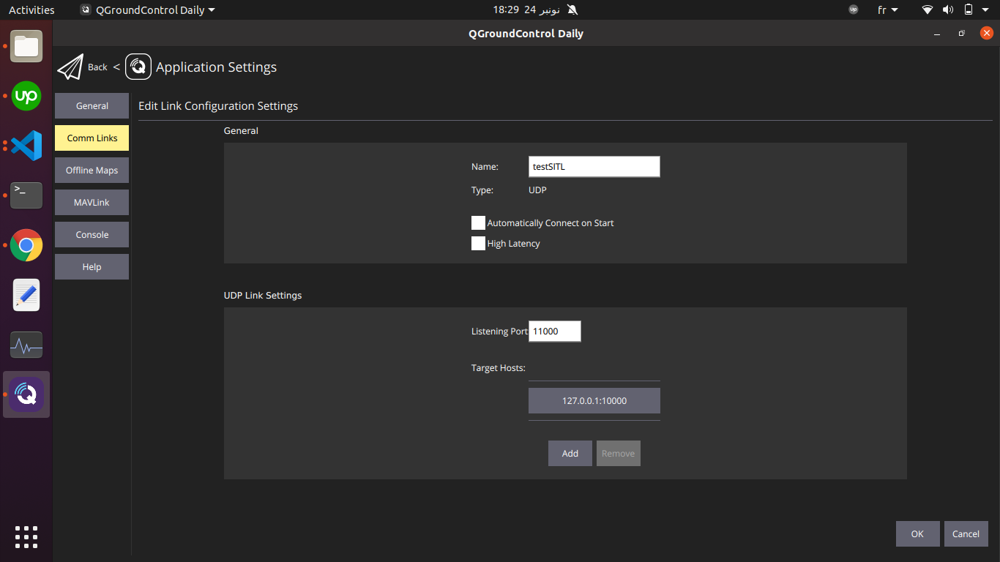
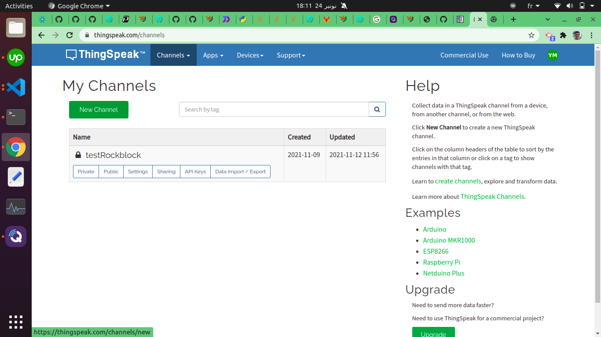
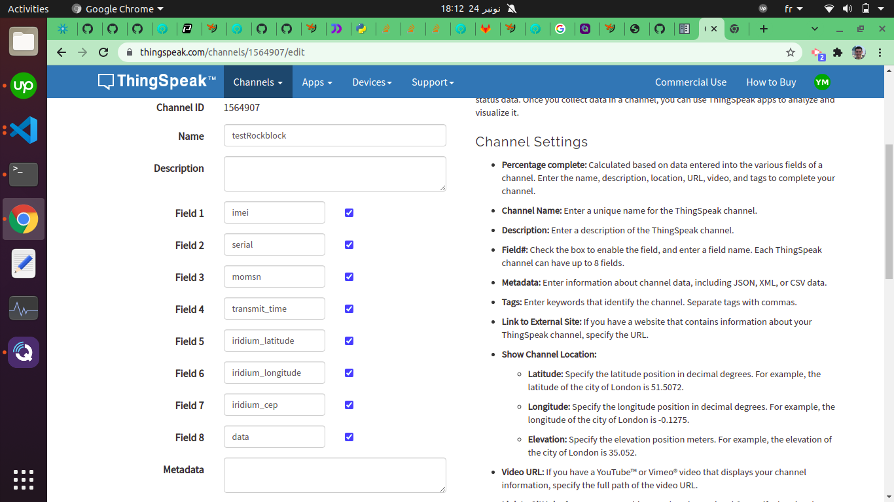
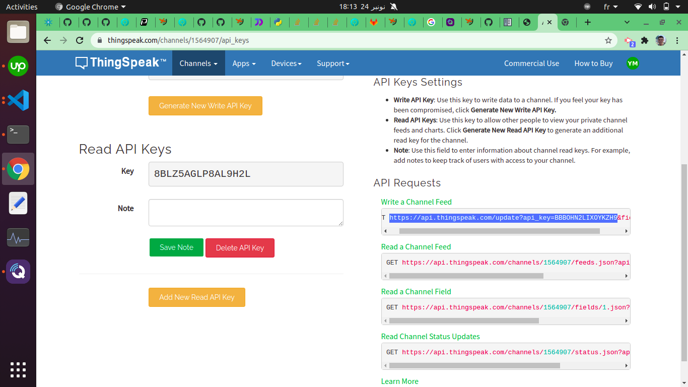
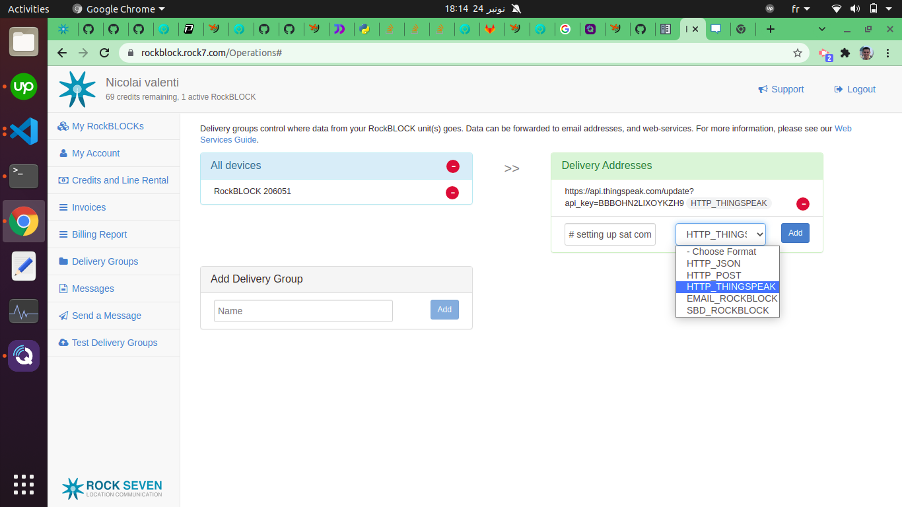

# HEIMDALL-PROJECT / GS part
connect rock7 web service to your application via thingspeak

# setting up sat communication on ground station (Running Ubuntu)


## **installing packages**
```
pip3 install dronekit 
pip3 install pymavlink
pip3 install requests
pip3 install dronekit-sitl -UI
Besides, install qgroundcontrol
```

## **QGroundControl**

Add a connection with these specifications:

    -UDP type

    -port : 11000
    
    -target host : 127.0.0.1:10000

select connection after saving, and hit connect.




## **Run a test**

1- first open a terminal and run

`dronekit-sitl copter`

this will initiate simulated vehicle, that can be connected to on **tcp:127.0.0.1:5760**.

Then run tests/test_local_conn_sitl.py code

`python3 tests/test_local_conn_sitl.py`

If everything works fine, you'll see that there is a vehicle on QGC ready to fly, you can even simulate flying it. 


## **Thingspeak**

This part is where you'll create a thingspeak account, channel and get http address to send your data from rock7.

1- create channel



2- edit channel settings



3- get thingspeak http address



4- add to delivery groups




## **POSTing to rockblock**

run tests/test_post.py

`python3 tests/test_post.py`

Check rock7 messages for the message.


## **GET from thingspeak**

`python3 tests/test_get.py`

you should see some data. Change parameters to your channel if you use a one that is different:

Thingspeak_Channel = 'https://api.thingspeak.com/channels/1564907/feeds.json?api_key=XYZ&results=1'

